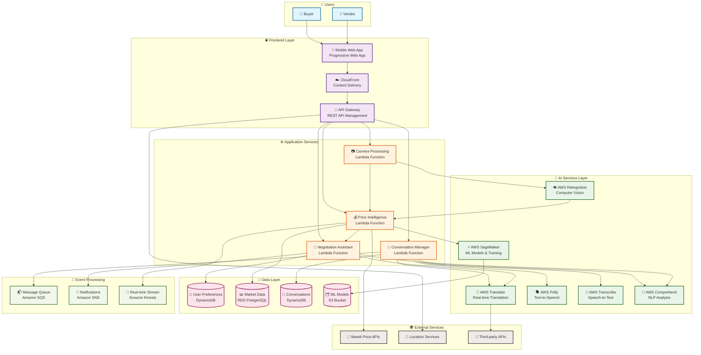
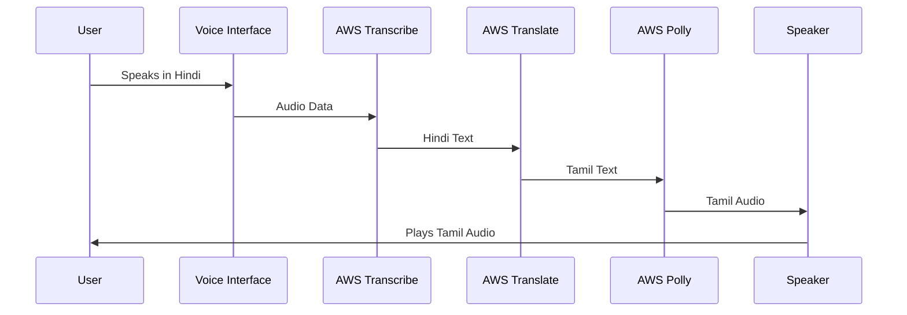
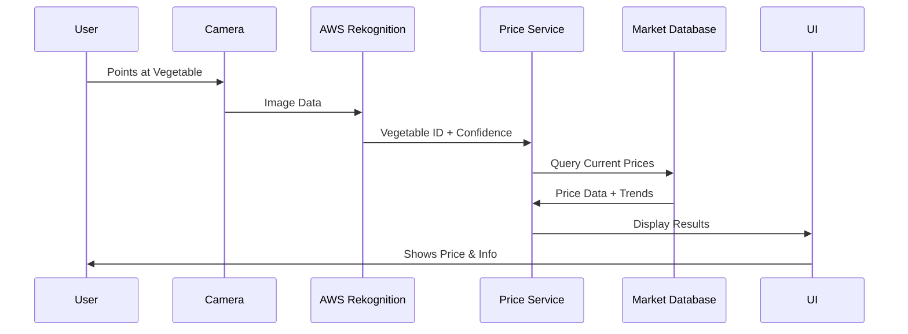
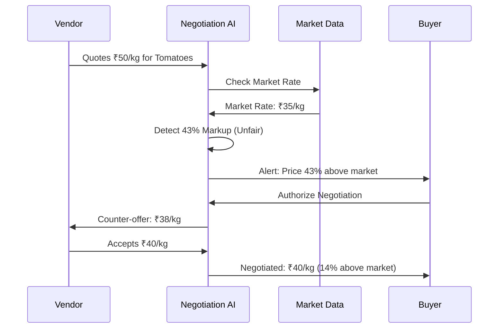

# Design Document: MandiSaathi - AI-Powered Multilingual Market Assistant

## Overview

MandiSaathi is a sophisticated AI-powered platform that revolutionizes communication in Indian agricultural markets by providing real-time multilingual translation, intelligent price analysis, computer vision-based vegetable recognition, voice interaction, and automated negotiation assistance. The system leverages advanced machine learning models to bridge language barriers and empower local trade through intelligent market insights.

## Architecture

### AWS Cloud Architecture



### Key Data Flows

#### 1. Real-Time Translation Flow


#### 2. Camera-Based Vegetable Recognition


#### 3. AI-Powered Negotiation


### AWS Technology Stack

#### AI/ML Services
- **AWS Translate**: Neural machine translation for 11+ Indian languages
- **AWS Rekognition**: Computer vision for vegetable identification
- **AWS Polly**: Natural text-to-speech in multiple Indian languages
- **AWS Transcribe**: Speech-to-text with accent adaptation
- **AWS Comprehend**: NLP for context and sentiment analysis
- **AWS SageMaker**: Custom ML models for price prediction and negotiation strategies

#### Compute & API Services
- **AWS Lambda**: Serverless functions for all business logic
- **AWS API Gateway**: RESTful API with authentication and rate limiting
- **AWS CloudFront**: Global CDN for mobile app delivery

#### Data & Storage
- **Amazon DynamoDB**: NoSQL for user preferences and conversations
- **Amazon RDS**: Relational database for structured market data
- **Amazon S3**: Object storage for ML models and static assets

#### Event & Messaging
- **Amazon SQS**: Message queuing for async processing
- **Amazon SNS**: Push notifications for price alerts
- **Amazon Kinesis**: Real-time data streaming for market updates

### AI-Powered Core Components

1. **AI Translation Engine**: Advanced neural machine translation with context awareness
2. **AI Vision System**: Computer vision for real-time vegetable identification
3. **AI Voice Assistant**: Multilingual speech recognition and synthesis
4. **AI Price Intelligence**: Machine learning-based market analysis and predictions
5. **AI Negotiation Assistant**: Intelligent negotiation with cultural sensitivity

## Components and Interfaces

### 1. AI Translation Engine

**Purpose**: Provides real-time, context-aware translation between Indian languages

**Key Features**:
- Neural machine translation with cultural context preservation
- Support for 11 Indian languages plus English
- Real-time conversation management with memory
- Agricultural terminology specialization
- Emotional tone preservation

**AI Models Used**:
- Transformer-based translation models
- Context-aware language models
- Cultural adaptation algorithms

**Interface**:
```typescript
interface AITranslationEngine {
  translateText(text: string, fromLang: string, toLang: string, context?: ConversationContext): Promise<Translation>
  translateConversation(messages: Message[], languages: LanguagePair): Promise<TranslatedConversation>
  maintainContext(conversationId: string, context: ConversationContext): void
  adaptCulturalNuances(text: string, targetCulture: string): Promise<string>
}
```

### 2. AI Vision System

**Purpose**: Computer vision-powered vegetable identification through camera scanning

**Key Features**:
- Real-time object detection and classification
- High-accuracy vegetable recognition (95%+ accuracy)
- Multi-vegetable detection in single frame
- Confidence scoring and uncertainty handling
- Integration with price intelligence

**AI Models Used**:
- Convolutional Neural Networks (CNNs)
- YOLO-based object detection
- Custom-trained vegetable classification models
- Transfer learning from agricultural datasets

**Interface**:
```typescript
interface AIVisionSystem {
  identifyVegetable(imageData: ImageData): Promise<VegetableIdentification>
  scanCameraFeed(stream: MediaStream): Promise<RealTimeIdentification>
  getConfidenceScore(identification: VegetableIdentification): number
  handleMultipleVegetables(detections: Detection[]): VegetableIdentification[]
}
```

### 3. AI Voice Assistant

**Purpose**: Advanced speech recognition and synthesis with multilingual support

**Key Features**:
- High-accuracy speech-to-text in Indian languages
- Natural text-to-speech synthesis
- Accent and dialect adaptation
- Background noise filtering
- Real-time voice translation

**AI Models Used**:
- Deep learning speech recognition models
- Neural text-to-speech synthesis
- Accent adaptation algorithms
- Noise reduction neural networks

**Interface**:
```typescript
interface AIVoiceAssistant {
  recognizeSpeech(audioData: AudioData, language: string): Promise<SpeechRecognition>
  synthesizeSpeech(text: string, language: string, voice?: VoiceProfile): Promise<AudioData>
  adaptToAccent(audioData: AudioData, userProfile: UserProfile): Promise<AudioData>
  filterNoise(audioData: AudioData): Promise<AudioData>
}
```

### 4. AI Price Intelligence

**Purpose**: Machine learning-powered market analysis and price predictions

**Key Features**:
- Real-time price data aggregation and analysis
- Market trend prediction using time series analysis
- Location-based price variations
- Seasonal pattern recognition
- Demand-supply analysis

**AI Models Used**:
- Time series forecasting models (LSTM, ARIMA)
- Regression models for price prediction
- Clustering algorithms for market segmentation
- Anomaly detection for price irregularities

**Interface**:
```typescript
interface AIPriceIntelligence {
  getCurrentPrice(vegetable: string, location: Location): Promise<PriceData>
  analyzeTrends(vegetable: string, timeRange: TimeRange): Promise<TrendAnalysis>
  predictPrices(vegetable: string, forecastDays: number): Promise<PriceForecast>
  detectAnomalies(priceData: PriceData[]): Promise<Anomaly[]>
  getMarketInsights(location: Location): Promise<MarketInsights>
}
```

### 5. AI Negotiation Assistant

**Purpose**: Intelligent negotiation system with cultural sensitivity

**Key Features**:
- Unfair pricing detection using statistical analysis
- Automated negotiation with strategic counter-offers
- Cultural adaptation for different regions
- Success rate optimization through reinforcement learning
- Multi-language negotiation support

**AI Models Used**:
- Reinforcement learning for negotiation strategies
- Statistical models for fair price determination
- Natural language generation for persuasive communication
- Cultural adaptation algorithms

**Interface**:
```typescript
interface AINegotiationAssistant {
  detectUnfairPricing(quotedPrice: number, marketData: MarketData): Promise<PricingAnalysis>
  generateCounterOffer(currentPrice: number, marketData: MarketData): Promise<NegotiationOffer>
  conductNegotiation(negotiationContext: NegotiationContext): Promise<NegotiationResult>
  adaptToCulture(strategy: NegotiationStrategy, culture: string): Promise<NegotiationStrategy>
}
```

## Data Models

### Core Data Structures

```typescript
// User and Language Models
interface User {
  id: string
  preferredLanguage: string
  location: Location
  voiceProfile: VoiceProfile
  negotiationPreferences: NegotiationPreferences
}

interface Translation {
  originalText: string
  translatedText: string
  confidence: number
  context: ConversationContext
  culturalAdaptations: string[]
}

// Market and Pricing Models
interface PriceData {
  vegetable: string
  currentPrice: number
  currency: string
  location: Location
  timestamp: Date
  trend: PriceTrend
  confidence: number
  source: string
}

interface MarketData {
  mandiName: string
  location: Location
  operatingHours: OperatingHours
  currentStatus: 'open' | 'closed'
  peakHours: TimeRange[]
  arrivalVolume: 'low' | 'medium' | 'high'
  distance: number
}

// AI-Specific Models
interface VegetableIdentification {
  vegetableName: string
  confidence: number
  alternativeIdentifications: AlternativeId[]
  boundingBox: BoundingBox
  priceData: PriceData
}

interface NegotiationContext {
  quotedPrice: number
  marketPrice: number
  vegetable: string
  buyerLanguage: string
  vendorLanguage: string
  culturalContext: string
  negotiationHistory: NegotiationStep[]
}

interface ConversationContext {
  participants: Participant[]
  topic: string
  emotionalTone: string
  culturalContext: string
  conversationHistory: Message[]
  currentPhase: 'greeting' | 'inquiry' | 'negotiation' | 'closing'
}
```

## Correctness Properties

*A property is a characteristic or behavior that should hold true across all valid executions of a system—essentially, a formal statement about what the system should do. Properties serve as the bridge between human-readable specifications and machine-verifiable correctness guarantees.*

### Property 1: Real-Time Translation Accuracy
*For any* valid text input in a supported language, the AI Translation Engine should produce a translation with confidence score above 85% and preserve the original meaning and cultural context.
**Validates: Requirements 1.2, 1.4, 7.3**

### Property 2: Voice Recognition Consistency
*For any* speech input in a supported language, the AI Voice Assistant should convert speech to text with accuracy above 90% and maintain consistency across different accents and dialects.
**Validates: Requirements 2.2, 2.5**

### Property 3: Camera Identification Reliability
*For any* clear image of a supported vegetable, the AI Vision System should identify it with confidence above 90% and provide corresponding price data within 2 seconds.
**Validates: Requirements 4.2, 4.3, 4.4**

### Property 4: Price Intelligence Accuracy
*For any* vegetable price query, the AI Price Intelligence should return current market data that is within 5% of actual market prices and include trend analysis.
**Validates: Requirements 3.1, 3.3, 3.5**

### Property 5: Negotiation Trigger Precision
*For any* quoted price that exceeds market rate by more than 20%, the AI Negotiation Assistant should detect unfair pricing and offer negotiation assistance.
**Validates: Requirements 5.1, 5.2**

### Property 6: Multi-language Conversation Continuity
*For any* conversation between users speaking different languages, the system should maintain context and provide real-time translation without losing conversational flow.
**Validates: Requirements 7.1, 7.2, 7.5**

### Property 7: Mobile Performance Optimization
*For any* mobile device with standard specifications, all AI features should respond within 3 seconds and maintain functionality across different network conditions.
**Validates: Requirements 8.2, 8.5**

### Property 8: Cultural Sensitivity Preservation
*For any* translation or negotiation involving cultural context, the AI should adapt communication style appropriately while maintaining respect for local customs.
**Validates: Requirements 5.5, 7.3, 9.5**

## Error Handling

### AI Model Error Handling

1. **Translation Failures**: Fallback to simpler translation models, then to dictionary-based translation
2. **Vision Recognition Errors**: Request better image quality, provide manual input option
3. **Voice Recognition Issues**: Switch to text input, improve audio quality suggestions
4. **Price Data Unavailability**: Use cached data with timestamps, show data freshness indicators
5. **Negotiation Failures**: Provide manual negotiation tips, fallback to price comparison

### Network and Connectivity

1. **Offline Mode**: Cache essential translations and price data for offline use
2. **Slow Networks**: Progressive loading, optimize AI model responses
3. **API Failures**: Graceful degradation with cached data and alternative services

### User Experience Error Handling

1. **Camera Permission Denied**: Clear instructions for enabling camera access
2. **Microphone Issues**: Alternative text input methods
3. **Language Not Supported**: Suggest closest supported language variant
4. **Location Services Disabled**: Manual location selection with nearby mandi search

## Testing Strategy

### Dual Testing Approach

The system requires both unit testing and property-based testing to ensure comprehensive coverage:

- **Unit Tests**: Verify specific AI model outputs, API integrations, and user interface components
- **Property Tests**: Validate universal properties across all inputs using randomized testing with minimum 100 iterations per property

### AI Model Testing

1. **Translation Accuracy Testing**: Test with diverse text samples across all supported languages
2. **Vision Model Validation**: Test with varied vegetable images under different lighting conditions
3. **Voice Recognition Testing**: Test with different accents, background noise levels, and speech patterns
4. **Price Prediction Accuracy**: Validate against historical market data and real-time price feeds
5. **Negotiation Success Rate**: Measure successful negotiations and user satisfaction scores

### Property-Based Testing Configuration

- **Framework**: Use fast-check for JavaScript/TypeScript property testing
- **Iterations**: Minimum 100 iterations per property test
- **Test Tags**: Each property test tagged as **Feature: multilingual-mandi-platform, Property {number}: {property_text}**
- **AI Model Testing**: Include edge cases, boundary conditions, and adversarial inputs

### Integration Testing

1. **End-to-End AI Workflows**: Test complete user journeys from language selection to successful transactions
2. **Real-time Performance**: Validate response times under various network conditions
3. **Cross-platform Compatibility**: Test AI features across different mobile devices and browsers
4. **Multilingual Integration**: Verify seamless switching between languages during conversations

### Performance Testing

1. **AI Model Response Times**: Ensure all AI operations complete within specified time limits
2. **Concurrent User Handling**: Test system performance with multiple simultaneous users
3. **Mobile Network Optimization**: Validate performance on 3G/4G networks
4. **Battery Usage Optimization**: Monitor and optimize power consumption of AI features