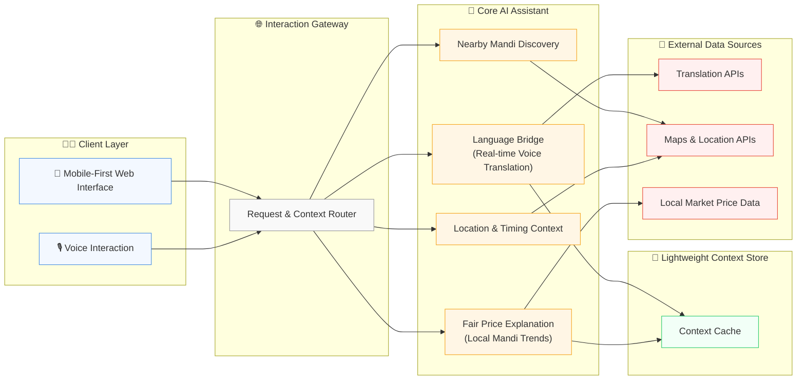

# Design Document: MandiSaathi

## Overview

MandiSaathi is a voice-first, mobile-first web assistant designed to break linguistic barriers in local Indian trade. The platform serves as a real-time communication bridge that helps vendors and buyers understand each other across languages, discover fair local prices, and find nearby mandis. Rather than being a transactional marketplace, MandiSaathi focuses on being a helpful companion for on-ground market interactions.

The platform architecture follows a lightweight, human-centered approach with core services for voice translation, local price intelligence, and mandi discovery. This design prioritizes simplicity, accessibility, and real-world usability for India's diverse local markets.

## Architecture

### High-Level Architecture



### Service Architecture Patterns

- **Mobile-First Design**: Optimized for smartphone usage with offline capabilities
- **Voice-First Interface**: Primary interaction through voice commands and responses
- **Lightweight Services**: Minimal, focused services for core functionality
- **Cached Intelligence**: Local caching for fast response times in poor network conditions

## Components and Interfaces

### 1. Voice Translation Service

**Purpose**: Provides real-time voice-to-voice translation for seamless communication between vendors and buyers speaking different languages.

**Key Components**:
- **Speech Recognition Module**: Converts voice input to text in multiple Indian languages
- **Language Detection Module**: Automatically identifies source language from speech
- **Translation Engine**: Integrates with translation APIs optimized for trade terminology
- **Text-to-Speech Module**: Converts translated text back to natural-sounding speech
- **Conversation Context Manager**: Maintains context for better translation accuracy

**Interfaces**:
```typescript
interface VoiceTranslationService {
  translateVoiceToVoice(audioInput: ArrayBuffer, targetLanguage: string): Promise<VoiceTranslationResult>
  detectLanguageFromVoice(audioInput: ArrayBuffer): Promise<LanguageDetectionResult>
  getConversationContext(sessionId: string): Promise<ConversationContext>
  clearConversationContext(sessionId: string): Promise<void>
}

interface VoiceTranslationResult {
  originalText: string
  translatedText: string
  translatedAudio: ArrayBuffer
  confidence: number
  sourceLang: string
  targetLang: string
}
```

### 2. Local Price Intelligence Service

**Purpose**: Provides contextual price information and fair price explanations for local market products.

**Key Components**:
- **Local Market Data Collector**: Gathers pricing data from nearby mandis and markets
- **Price Context Engine**: Explains price variations based on quality, season, and location
- **Fair Price Calculator**: Determines reasonable price ranges for products
- **Price Trend Analyzer**: Shows simple price trends and seasonal patterns

**Interfaces**:
```typescript
interface LocalPriceService {
  getLocalPriceInfo(productName: string, location: Location, language: string): Promise<PriceInfo>
  explainPriceContext(price: number, productName: string, location: Location): Promise<PriceExplanation>
  getSimplePriceTrends(productName: string, location: Location): Promise<SimpleTrend>
}

interface PriceInfo {
  productName: string
  averagePrice: number
  priceRange: { min: number, max: number }
  explanation: string
  factors: string[]
  confidence: 'high' | 'medium' | 'low'
}
```

### 3. Mandi Discovery Service

**Purpose**: Helps users find nearby mandis with basic information about timings and accessibility.

**Key Components**:
- **Location-Based Search**: Finds mandis within specified radius
- **Mandi Information Manager**: Maintains basic data about mandi timings and characteristics
- **Route Guidance**: Provides simple directions to nearby mandis
- **Mandi Status Tracker**: Shows current open/closed status and peak times

**Interfaces**:
```typescript
interface MandiDiscoveryService {
  findNearbyMandis(location: Location, radius: number): Promise<MandiInfo[]>
  getMandiDetails(mandiId: string): Promise<DetailedMandiInfo>
  getMandiStatus(mandiId: string): Promise<MandiStatus>
  getDirections(fromLocation: Location, toMandiId: string): Promise<SimpleDirections>
}

interface MandiInfo {
  id: string
  name: string
  location: Location
  distance: number
  isOpen: boolean
  peakHours: string
  specialties: string[]
}
```

### 4. Simple Communication Helper

**Purpose**: Facilitates basic communication assistance for common market interactions.

**Key Components**:
- **Common Phrases Library**: Pre-translated common market phrases and questions
- **Context-Aware Suggestions**: Suggests relevant phrases based on conversation context
- **Cultural Etiquette Helper**: Provides simple cultural tips for respectful communication
- **Emergency Phrases**: Quick access to important phrases for urgent situations

**Interfaces**:
```typescript
interface CommunicationHelper {
  getCommonPhrases(category: string, language: string): Promise<Phrase[]>
  suggestRelevantPhrases(context: string, language: string): Promise<Phrase[]>
  getCulturalTips(sourceLanguage: string, targetLanguage: string): Promise<CulturalTip[]>
  getEmergencyPhrases(language: string): Promise<Phrase[]>
}

interface Phrase {
  id: string
  text: string
  audioUrl: string
  category: string
  usage: string
}
```

## Data Models

### Core Entities

```typescript
interface User {
  id: string
  name: string
  phone: string
  preferredLanguage: string
  location: Location
  userType: 'vendor' | 'buyer' | 'both'
  createdAt: Date
}

interface MandiInfo {
  id: string
  name: string
  location: Location
  openingHours: {
    open: string
    close: string
    peakStart: string
    peakEnd: string
  }
  daysOpen: string[]
  specialties: string[]
  facilities: string[]
  contactInfo?: string
  isVerified: boolean
}

interface PriceData {
  id: string
  productName: string
  location: Location
  averagePrice: number
  priceRange: { min: number, max: number }
  unit: string
  quality: 'premium' | 'standard' | 'basic'
  season: string
  lastUpdated: Date
  source: string
}

interface ConversationSession {
  id: string
  participants: string[]
  sourceLanguage: string
  targetLanguage: string
  context: string
  startTime: Date
  lastActivity: Date
  isActive: boolean
}
```

### Supporting Data Models

```typescript
interface Location {
  latitude: number
  longitude: number
  address: string
  city: string
  state: string
  pincode: string
  country: string
}

interface VoiceInput {
  audioData: ArrayBuffer
  duration: number
  quality: 'high' | 'medium' | 'low'
  timestamp: Date
}

interface PriceExplanation {
  factors: PriceFactor[]
  seasonalImpact: string
  qualityImpact: string
  locationImpact: string
  recommendation: string
  confidence: number
}

interface PriceFactor {
  name: string
  impact: 'positive' | 'negative' | 'neutral'
  description: string
  weight: number
}

interface CulturalTip {
  sourceLanguage: string
  targetLanguage: string
  category: 'greeting' | 'negotiation' | 'respect' | 'general'
  tip: string
  example?: string
}
```

## Scope Note

This document represents a conceptual design generated during the ideation phase using Kiro.  
The purpose of this submission is to visualize how AI can break linguistic barriers in local mandis, not to implement or formally verify a production system.

Detailed validation, correctness guarantees, and testing strategies are considered future work and are intentionally out of scope.
